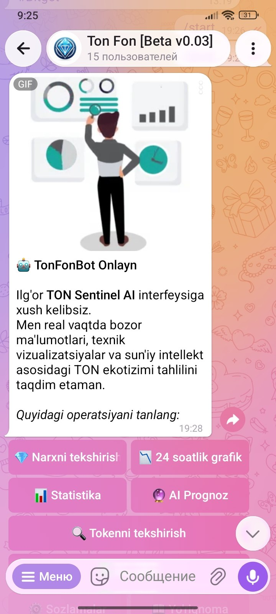
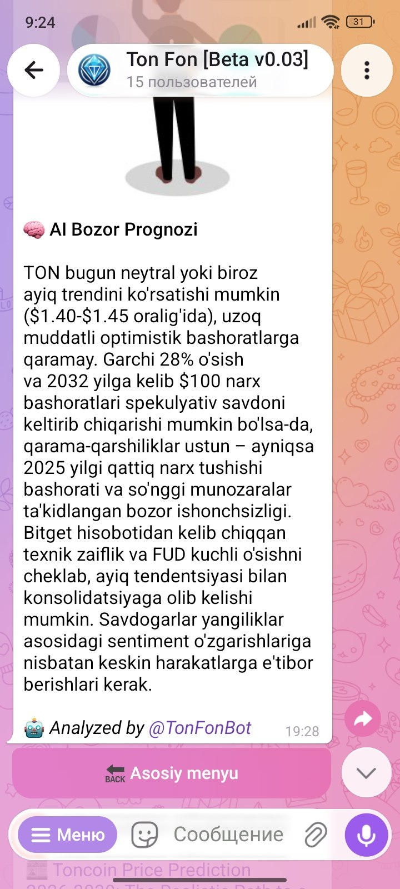
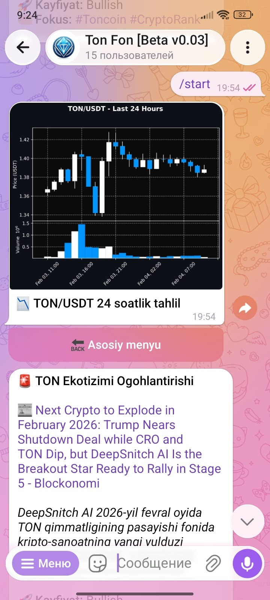

<div align="right">

[](https://python.org)
[](https://aiogram.dev)
[](https://openrouter.ai)
[](https://trychroma.com)
[](LICENSE)

</div>

---

```
  Not just a price bot.
  It reads the news. Understands the context. Speaks your language.
  Runs 24/7. Needs no human intervention.
```

---

<br/>

<table>
<tr>
<td width="50%" valign="top">

### 🧠 AI Analyst
DeepSeek model via OpenRouter.
Classifies news as Bullish / Bearish / Neutral.
Generates summaries in 3 languages.

`English` `Russian` `Uzbek`

</td>
<td width="50%" valign="top">

### 📰 RSS News Fetcher
Polls Cointelegraph, Coindesk and more
every **10 minutes**. TON-keyword filtered.
Smart deduplication via ChromaDB.

`24/7` `Auto-broadcast` `No repeats`

</td>
</tr>
<tr>
<td width="50%" valign="top">

### 📊 Visual Generators
Professional charts & infographics —
bot sends images, not just text.

`Price Charts` `Market Stats` `Daily Gains`

</td>
<td width="50%" valign="top">

### 🔍 Token Scanner
Scans TON blockchain via TONAPI.
Lets users verify token safety
directly inside Telegram.

`TONAPI` `On-chain` `Token Safety`

</td>
</tr>
</table>

## Screenshots

<div align="center">
  
  
  
</div>

<br/>

---

## Architecture

```
  ┌──────────────────────────────────────────────────────┐
  │                   Telegram Interface                  │
  │         aiogram 3.x  ·  Button-based UI              │
  └────────────────────────┬─────────────────────────────┘
                           │
  ┌────────────────────────▼─────────────────────────────┐
  │                  Service Layer                        │
  │                                                      │
  │  AIAnalyst.py          RSSFetcher.py                 │
  │  AI summaries &        News polling &                │
  │  market forecasts      deduplication                 │
  │                                                      │
  │  ChartGenerator.py     TokenScanner.py               │
  │  Price charts &        TON blockchain                │
  │  stat infographics     token verification            │
  └────────────────────────┬─────────────────────────────┘
                           │
  ┌────────────────────────▼─────────────────────────────┐
  │                  Data Layer (Hybrid)                  │
  │                                                      │
  │  SQLAlchemy + SQLite          ChromaDB               │
  │  Users · Channels             Vector Memory          │
  │  Settings · Forecasts         RAG · Deduplication    │
  └──────────────────────────────────────────────────────┘
```

> **Why hybrid DB?** SQLite handles structured data. ChromaDB handles semantic memory — it lets the AI "remember" past news as mathematical vectors, not keywords.

<br/>

---

## Automated Workflow

```
Every 10 min   RSSFetcher polls news sources
               └─ Filter: TON keywords only
                  └─ ChromaDB: "Seen this before?"
                     ├─ YES → skip
                     └─ NO  → AIAnalyst summarizes
                              └─ Broadcast to all users & channels
                                 in their preferred language

09:00 UZB      Market Overview infographic sent automatically

09:01 UZB      AI Daily Forecast generated from morning news
               + vector memory of past events

Custom         Channel owners set their own price update interval
interval       (e.g. every 15 min) → bot acts as content engine
```

<br/>

---

## Engineering Highlights

&nbsp;&nbsp;🧬 &nbsp;**RAG Memory** — ChromaDB stores news as vectors. AI never repeats old stories; it understands semantic similarity, not just keywords.

&nbsp;&nbsp;⚡ &nbsp;**Fully Async** — Built on `asyncio` + `aiogram 3.x`. Every service runs concurrently without blocking.

&nbsp;&nbsp;🕐 &nbsp;**APScheduler** — All timed jobs (news fetch, morning brief, price updates) run on a strict schedule, 24/7.

&nbsp;&nbsp;🌍 &nbsp;**Multilingual AI** — Same news, three outputs. DeepSeek generates EN / RU / UZ summaries in one call.

&nbsp;&nbsp;📡 &nbsp;**Channel Engine** — Bot owners can plug TonFonbot into any Telegram channel as an automated content pipeline.

<br/>

---

## User Features

```yaml
live_price:       Instant TON/USDT rate on demand
ai_forecast:      Daily market prediction from AI
technical_chart:  Price chart generated on request
language_switch:  EN · RU · UZ — instant UI rebuild
channel_mode:     Automated price & news feed for channel owners
token_check:      Verify any TON token via blockchain scan
```

<br/>

---

## Stack

```yaml
framework:      aiogram 3.x  (async Telegram)
ai:             OpenRouter  →  DeepSeek model
database:       SQLAlchemy + SQLite  (structured)
vector_db:      ChromaDB  (RAG / semantic memory)
scheduler:      APScheduler
financial:      ccxt  (live exchange data)
charts:         mplfinance  (price chart rendering)
blockchain:     TONAPI  (token scanning)
languages:      English · Russian · Uzbek
```

<br/>

---

## Quick Start

```bash
git clone https://github.com/aza4k/TonFonbot.git && cd TonFonbot

python -m venv venv && source venv/bin/activate
pip install -r requirements.txt

cp .env.example .env
# Fill in: BOT_TOKEN, OPENROUTER_API_KEY, TONAPI_KEY

python main.py
```

**Prerequisites:** Python `3.11+` · Telegram Bot Token · OpenRouter API Key · TONAPI Key

<br/>

---

## Project Structure

```
TonFonbot/
├── services/
│   ├── AIAnalyst.py           ← DeepSeek summaries & forecasts
│   ├── RSSFetcher.py          ← news polling & deduplication
│   ├── ChartGenerator.py      ← mplfinance price charts
│   ├── StatsGenerator.py      ← daily stat infographics
│   └── TokenScanner.py        ← TONAPI blockchain queries
├── database/
│   ├── models.py              ← SQLAlchemy models
│   └── vector_store.py        ← ChromaDB interface
├── handlers/                  ← aiogram routers
├── scheduler/                 ← APScheduler jobs
├── locales/                   ← en · ru · uz translations
└── main.py
```

<br/>

---

<div align="center">


MIT License · © [aza4k](https://github.com/aza4k) · Developed by **[fundev](https://fundev.uz)**

</div>
